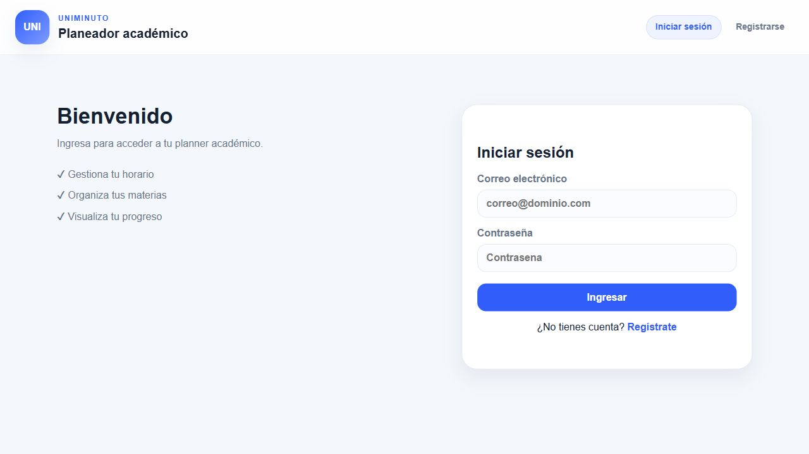
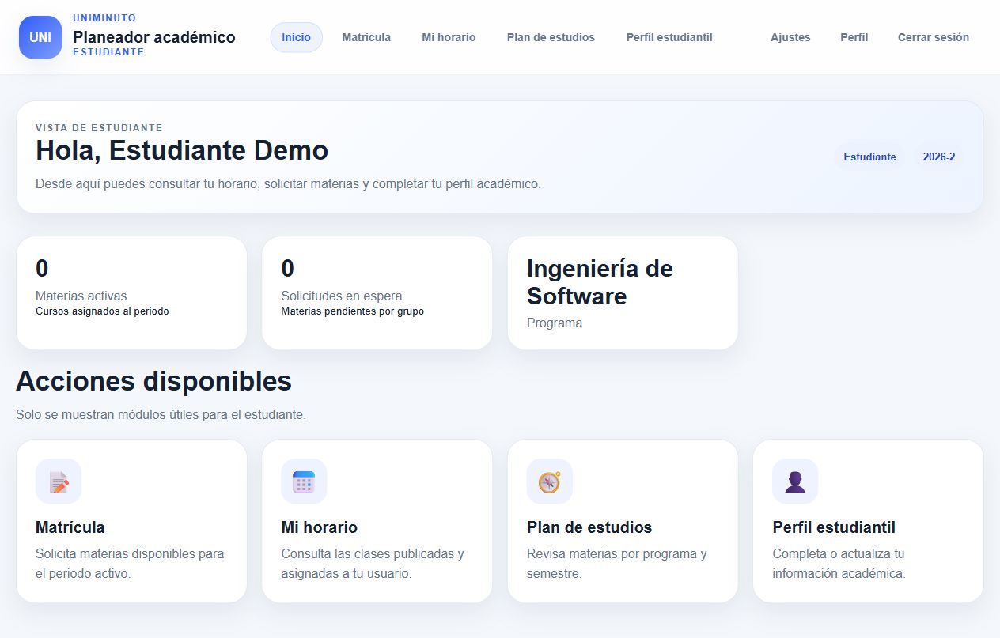
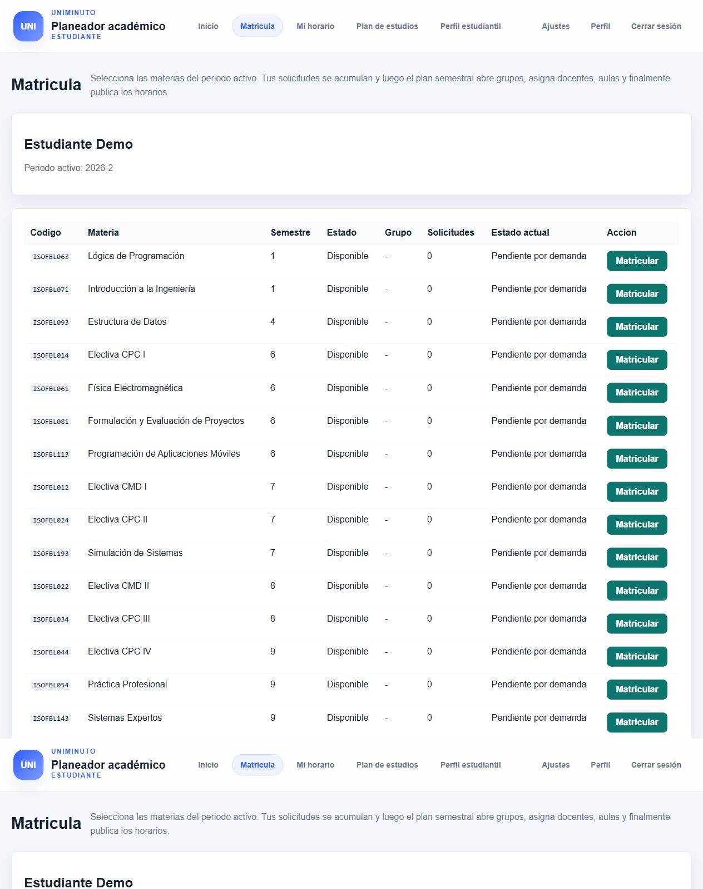
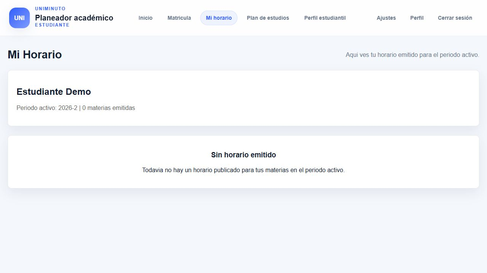
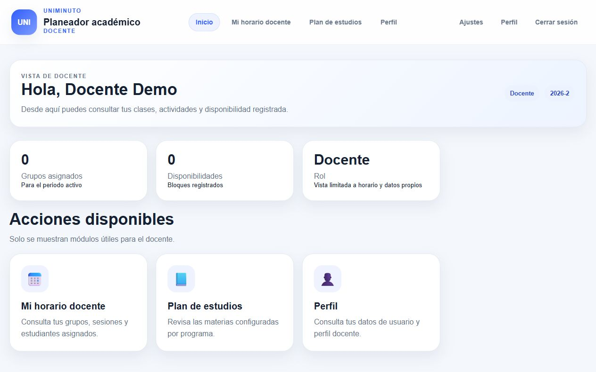
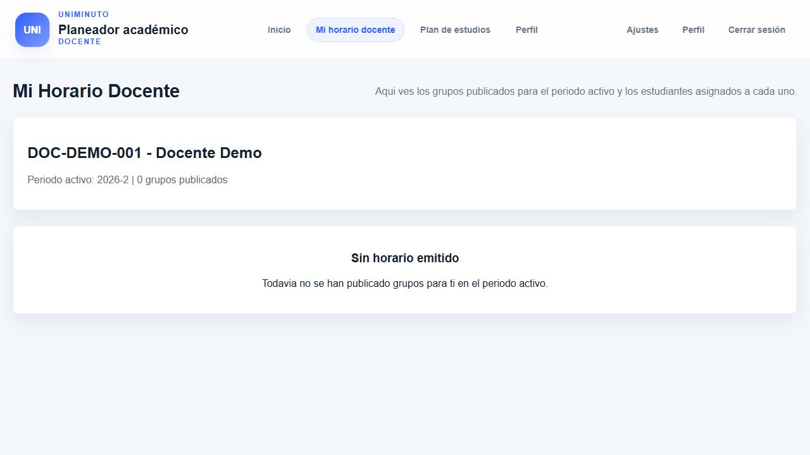
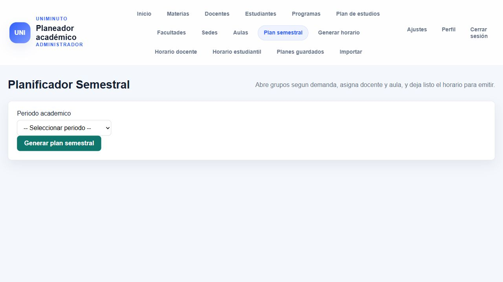
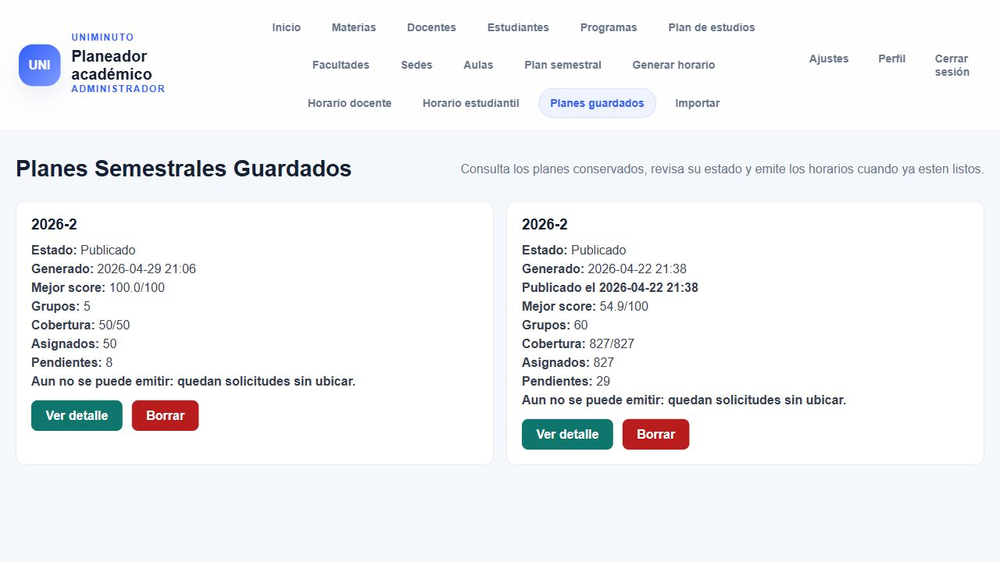

# Manual de Usuario - Project Planner

Fecha: 18 de mayo de 2026

## 1. Acceso al sistema

1. Abra la aplicacion en el navegador.
2. Escriba su correo institucional.
3. Escriba su contrasena.
4. Presione **Ingresar**.

### Cuentas de prueba

| Rol | Correo | Contrasena |
|---|---|---|
| Estudiante | `estudiante.demo@uniminuto.edu.co` | `Estudiante2026!` |
| Docente | `docente.demo@uniminuto.edu.co` | `Docente2026!` |
| Administrador | `admin.demo@uniminuto.edu.co` | `Admin2026!` |
| Director academico | `director.demo@uniminuto.edu.co` | `Director2026!` |

## 2. Funciones por rol

| Rol | Funciones principales |
|---|---|
| Estudiante | Completar perfil, solicitar matricula, consultar horario y revisar plan de estudios. |
| Docente | Consultar horario docente y revisar perfil. |
| Administrador | Gestionar datos academicos, importar estudiantes, generar plan semestral y consultar horarios. |
| Director academico | Generar, revisar, aplicar, revertir y publicar planes semestrales. |

## 3. Estudiante

### 3.1 Completar perfil estudiantil

1. Inicie sesion como estudiante.
2. En el menu, seleccione **Perfil estudiantil**.
3. Complete o revise sus datos personales y academicos.
4. Presione **Guardar perfil**.

### 3.2 Solicitar matricula

1. En el menu, seleccione **Matricula**.
2. Revise las materias disponibles.
3. Ubique la materia que desea solicitar.
4. Presione **Matricular**.
5. Verifique el mensaje de confirmacion o el cambio de estado.

### 3.3 Consultar mi horario

1. En el menu, seleccione **Mi horario**.
2. Revise las materias asignadas.
3. Consulte grupo, dia, hora, docente y aula.

## 4. Docente

### 4.1 Consultar horario docente

1. Inicie sesion como docente.
2. En el menu, seleccione **Mi horario docente**.
3. Revise las clases asignadas.
4. Consulte materia, grupo, dia, hora y aula.

## 5. Administrador

### 5.1 Gestionar datos academicos

1. Inicie sesion como administrador.
2. Seleccione el modulo que desea gestionar.
3. Revise la lista de registros.
4. Use la opcion disponible para crear, editar o eliminar.
5. Guarde los cambios.

| Modulo | Uso |
|---|---|
| Materias | Registrar y actualizar asignaturas. |
| Docentes | Gestionar docentes y disponibilidad. |
| Estudiantes | Consultar y administrar perfiles estudiantiles. |
| Programas | Gestionar programas academicos. |
| Sedes y facultades | Mantener la estructura academica. |
| Aulas | Registrar y consultar espacios fisicos o virtuales. |

### 5.2 Importar estudiantes

1. En el menu, seleccione **Importar**.
2. Cargue el archivo Excel.
3. Confirme la importacion.
4. Revise el resumen de estudiantes creados, omitidos o con error.

### 5.3 Generar plan semestral

1. En el menu, seleccione **Plan semestral**.
2. Seleccione el periodo academico.
3. Presione la opcion para generar el plan.
4. Revise las opciones generadas.
5. Seleccione la mejor opcion.
6. Aplique la opcion seleccionada.

### 5.4 Consultar planes guardados

1. En el menu, seleccione **Planes guardados**.
2. Revise la lista de planes.
3. Abra el plan que desea consultar.
4. Revise estado, periodo y resumen de asignaciones.

## 6. Director academico

### 6.1 Generar y revisar plan semestral

1. Inicie sesion como director academico.
2. Seleccione **Plan semestral**.
3. Seleccione el periodo academico.
4. Genere las opciones.
5. Compare las opciones generadas.

### 6.2 Aplicar una opcion

1. Abra el detalle del plan.
2. Seleccione la opcion que desea usar.
3. Presione **Aplicar**.
4. Verifique que el sistema confirme la aplicacion.

### 6.3 Publicar horarios

1. Abra el plan aplicado.
2. Verifique que no haya pendientes por resolver.
3. Presione **Publicar**.
4. Confirme que el plan quede publicado.

### 6.4 Revertir una aplicacion

1. Abra el plan semestral.
2. Seleccione la opcion aplicada.
3. Presione **Revertir**.
4. Seleccione o genere una nueva opcion si es necesario.

## 7. Estados comunes

| Estado o mensaje | Significado | Accion recomendada |
|---|---|---|
| Pendiente por demanda | La materia fue solicitada, pero aun no tiene grupo asignado. | Esperar la generacion del plan semestral. |
| No hay solicitudes pendientes | No hay demanda para generar el plan del periodo. | Verificar matriculas o periodo seleccionado. |
| Horario vacio | No existen horarios publicados para el usuario. | Revisar si el plan semestral ya fue publicado. |
| No tienes permisos | El rol no puede acceder a ese modulo. | Iniciar sesion con el rol correspondiente. |
| Credenciales incorrectas | Correo o contrasena no validos. | Revisar los datos e intentar de nuevo. |

## 8. Flujo recomendado

| Rol | Paso a paso recomendado |
|---|---|
| Estudiante | Iniciar sesion -> Perfil estudiantil -> Matricula -> Mi horario |
| Docente | Iniciar sesion -> Mi horario docente |
| Administrador | Iniciar sesion -> Actualizar datos -> Plan semestral -> Planes guardados |
| Director academico | Iniciar sesion -> Plan semestral -> Aplicar opcion -> Publicar |

## 9. Recomendaciones

1. Verifique el periodo academico antes de generar un plan.
2. Mantenga actualizados docentes, aulas, materias y programas.
3. Genere el plan semestral despues de registrar solicitudes de matricula.
4. Publique solo cuando el plan ya este revisado.
5. Cierre sesion al terminar.

